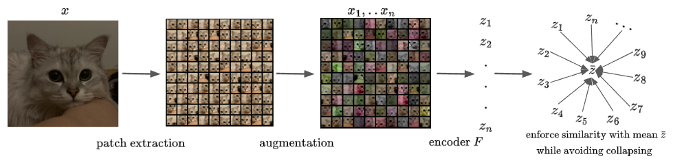

# Self-Supervised Learning in One Training Epoch

[](https://arxiv.org/abs/2304.03977)

This is an unofficial implementation of the paper "EMP-SSL: Towards Self-Supervised Learning in One Training Epoch", which you can access on [arXiv](https://arxiv.org/abs/2304.03977).

Original repo could be found here: [EMP-SSL](https://github.com/tsb0601/EMP-SSL). The code here is cleaned up and simplified to facilitate faster iterations. Crucially a lot of operations are reimplemented to minimize re-allocations between GPU and RAM. Extra care was taken about random seeding to ensure that the results of each run are consistently reproducible.

A tip of the hat to the [solo-learn](https://github.com/vturrisi/solo-learn) repository, from which the implementation of the LARS scheduler is borrowed.

The code is rigorously tested using both the `cifar10` and `cifar100` datasets. The quality of the representation is gauged by the performance of a linear classifier (comprising a single linear layer) trained over 100 epochs. As of now, KNN classification for evaluation hasn't been implemented. On the bright side, the entire process — covering both pre-training and final evaluation — takes < 20 minutes when run on a single Nvidia RTX A6000.

## Introduction

The paper "EMP-SSL" introduces a simplistic but efficient self-supervised learning method called Extreme-Multi-Patch Self-Supervised-Learning. The learning framework is schematically shown below (fig. from the paper):



Please, refer to the original paper for more details.

## Install

Clone the repo:

```shell
$ git clone https://github.com/kachayev/ssl-in-one-epoch.git
$ cd ssl-in-one-epoch
```

Install libraries using `pip`:

```shell
$ pip install -r requirements.txt
```

Or using `conda`:

```shell
$ conda create -n ssl-in-one-epoch python==3.10
$ conda activate ssl-in-one-epoch
$ conda install pytorch torchvision numpy tqdm Pillow -c pytorch
```

## Run Experiment

To kick off an experiment, utilize the `main.py` script:

```shell
$ python main.py train --n_patches 20 --bs 100
Files already downloaded and verified
===> Training SSL encoder
500it [06:38,  1.26it/s]
Epoch: 0 | Loss sim: -0.80343 | Loss TCR: -168.46286
500it [06:38,  1.26it/s]
Epoch: 1 | Loss sim: -0.81066 | Loss TCR: -173.45868
===> Encoding 'train' dataset for evaluation
...
```

Every experiment progresses through these stages:

    1. Train the image encoder leveraging the SSL loss.
    2. Encode all images from the provided train/test dataset.
    3. Fit a linear classifier using the encoded images as features.

Flexible artifacts caching is used to ensure that if an experiment is interrupted, it will automatically pick up from where it left off.

Logs are, by default, stored in the `logs/EMP-SSL-Training/*`` directory. Fancy a different location? Simply use the `--log_folder`` flag when launching your experiment.

Full list of options:

```shell
usage: main.py train [--exp_name EXP_NAME] [--dataset {cifar10,cifar100}] [--n_patches N_PATCHES] [--arch {resnet18-cifar,resnet18-imagenet,resnet18-tinyimagenet}]
               [--n_epochs N_EPOCHS] [--bs BS] [--lr LR] [--log_folder LOG_FOLDER] [--device DEVICE] [--seed SEED] [--save_proj] [--pretrained_proj PRETRAINED_PROJ]
               [--h_dim H_DIM] [--z_dim Z_DIM] [--uniformity_loss {tcr,vonmises}] [--emb_pool {features,proj}] [--invariance_loss_weight INVARIANCE_LOSS_WEIGHT]
               [--uniformity_loss_weight UNIFORMITY_LOSS_WEIGHT] [--resume] [--tcr_eps TCR_EPS]

SSL-in-one-epoch

optional arguments:
  -h, --help            show this help message and exit
  --exp_name EXP_NAME   experiment name (default: default)
  --dataset {cifar10,cifar100}
                        data (default: cifar10)
  --n_patches N_PATCHES
                        number of patches used in EMP-SSL (default: 100)
  --arch {resnet18-cifar,resnet18-imagenet,resnet18-tinyimagenet}
                        network architecture (default: resnet18-cifar)
  --n_epochs N_EPOCHS   max number of epochs to finish (default: 2)
  --bs BS               batch size (default: 100)
  --lr LR               learning rate (default: 0.3)
  --log_folder LOG_FOLDER
                        directory name (default: logs/EMP-SSL-Training)
  --device DEVICE       device to use for training (default: cuda)
  --seed SEED           random seed
  --save_proj           include this flag to save patch embeddings and projections
  --pretrained_proj PRETRAINED_PROJ
                        use pretrained weights for the projection network
  --h_dim H_DIM         patch embedding dimensionality
  --z_dim Z_DIM         projection dimensionality
  --uniformity_loss {tcr,vonmises}
                        loss to use for enforcing output space uniformity (default: tcr)
  --emb_pool {features,proj}
                        which tensors to pool as a final representation (default: features)
  --invariance_loss_weight INVARIANCE_LOSS_WEIGHT
                        coefficient of token similarity (default: 200.0)
  --uniformity_loss_weight UNIFORMITY_LOSS_WEIGHT
                        coefficient of token uniformity (default: 1.0)
  --resume              if training should be resumed from the latest checkpoint
```

To resume training for existing experiment, use `resume` command:

```shell
python main.py resume --exp_dir logs/EMP-SSL-Training/default__numpatch100_bs100_lr0.3/
* Loaded configuration settings from: logs/EMP-SSL-Training/default__numpatch100_bs100_lr0.3/hparams.yaml
...
```

You can also pass 


## Additional Experimentation Insights

* The use of the `ReLU` activation within the feature encoder doesn't appear to significantly alter performance. Utilizing alternative activation layers, such as `Tanh`, yields comparable results. Interestingly, while in some cases a `ReLU` post a `BatchNorm1d` can carry nuanced implications, that doesn't seem to be the scenario here.

* The inclusion of `BatchNorm1d` is not paramount (by any means), both for the feature encoder and the projection network. Removing both batch norms drops top1 test performance for `n_patches=50` on CIFAR10 from 89.25% to 88.81%.

* The TCR loss displays a marked sensitivity concerning the number of patches used and the structure of the batch. As one might intuitively expect, when a batch inadvertently contains patches from the same image, there's a considerable dip in performance.

* LARS optimizer is critical. Without it, the top1 accuracy for `n_patches=50` on CIFAR10 is only 57.97%. This fact is worrisome without good theoretical understanding of what exactly leads to such performance gain when applying LARS. It seems one of the original goal was to find an SSL algorithm that doesn't depend drastically on details of the training regime.

* Loading pre-trained weights for projection network and keeping it frozen yields 87.35-86.85% top1 accuracy on CIFAR10 with 50 patches (over multiple runs). This is somewhat surprising, I would expect the network to converge to roughly the same quality of the representation. As we don't have supervision signal, this might mean that existing projection network induce bias in the learning process w.r.t. to the loss function used.

* It's possible to use mean projection as embedding with similar output performance (instead of relying on the activations from intermediate layer) with the following changes: a) increase `z_dim` to 4096, `h_dim` could be decrease to 2048; b) replace TCR loss with logarithm of the average pairwise Gaussian potential between mean embeddings, corresponding loss weight set to 1.5 instead of 200.0; c) increase number of training epochs to 10 while only training on 20-25 patches instead of 200 (yields faster training in wall time).

(This list will be updated with more experiments.)